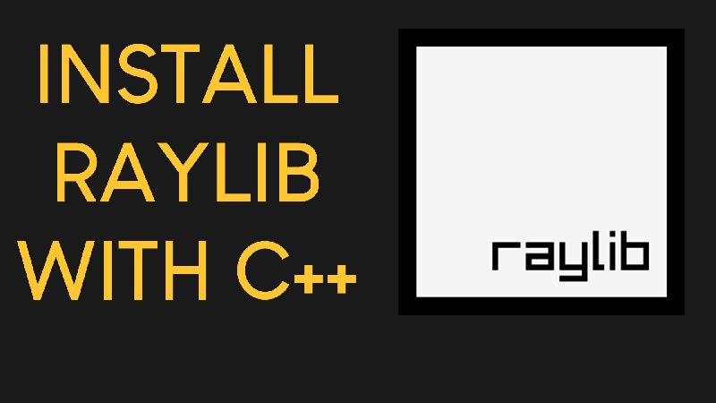

# Ping Pong Game using Raylib and C++ 

###The ping_pong_game_main.cpp contains project code.

It works with raylib version 4.5.
Tested on both Windows 10 and Windows 11.

# Video Tutorial

  

🎥 <a href="https://www.youtube.com/watch?v=PaAcVk5jUd8">Video Tutorial on YouTube</a>

 
 
